# Technical Design & Implementation Plan

## Project Title: Neurofoundry Web Platform
### Subtitle: Modular Web Application for Project Management, Media, and Collaboration

---

## Overview

**Executive Summary:**
Neurofoundry is a modular web platform designed for project management, media handling, and collaborative workflows. The system is structured around a central entry point (home.html) and a set of interconnected HTML, JS, and asset files, leveraging shared components for UI consistency and maintainability. The platform is intended for rapid feature extension, robust user interaction, and seamless integration of analytics and reporting.

**Key Features:**
- Centralized navigation via home.html
- Modular page structure (projects, gallery, crew, etc.)
- Shared UI components and styles
- Integrated chatbot and reporting tools
- Media gallery and downloads management
- User authentication (login/signup)
- Analytics and reporting dashboard
- Responsive design and micro-interactions
- Extensible for new modules/features

**Technical Scope:**
- Web platform (desktop/mobile responsive)
- Target: 1000+ concurrent users, 100+ req/sec
- Modern HTML5, CSS3, JavaScript (ES6+)
- Modular, maintainable, and scalable architecture

---

## Technology Stack & Dependencies

| Layer         | Technology                | Version/Notes           |
|--------------|---------------------------|-------------------------|
| Frontend     | HTML5, CSS3, JavaScript   | ES6+, Vanilla           |
| UI Framework | Custom/shared components  | shared/styles.css, JS   |
| Auth         | Custom (login/signup)     | JWT/Session (planned)   |
| Analytics    | Custom/reporting          | neurofoundry-report.html|
| Assets       | Static (assets/)          | Images, icons, etc.     |
| Build/Deploy | Manual/Scripted           | (User-provided hosting) |

---

## Hierarchical Navigation & Logic Flow

```mermaid
graph TB
    A[home.html] --> B[index.html]
    A --> C[projects.html]
    A --> D[gallery.html]
    A --> E[crew.html]
    A --> F[login.html]
    A --> G[signup.html]
    A --> H[downloads.html]
    A --> I[technology.html]
    A --> J[forge_final.html]
    A --> K[chatbot-component.js]
    A --> L[neurofoundry-report.html]
    A --> M[stock_divs.html]
    A --> N[nodes-demo.html]
    %% Shared components
    subgraph Shared
        O[shared/styles.css]
        P[shared/page-transitions.js]
        Q[shared/micro-interactions.js]
        R[shared/neural-particles.js]
    end
    A --> O
    A --> P
    A --> Q
    A --> R
    %% Assets
    S[assets/]
    A --> S
```

---

## Component Relationships
- All main HTML files import shared/styles.css and shared JS for UI consistency.
- Navigation is handled via links/buttons in home.html and other main pages.
- Chatbot and reporting are integrated as modular components (chatbot-component.js, neurofoundry-report.html).
- Assets (images, icons) are loaded from assets/ as needed by each page.

---

## Actionable Steps for Finalization & Testing

1. Review all navigation links in home.html and ensure they point to the correct modules/pages.
2. Verify shared components (styles, JS) are loaded and functional on all main pages.
3. Test chatbot integration and reporting dashboard for expected behavior.
4. Check all media/gallery/downloads features for correct asset loading and UI display.
5. Validate authentication flows (login/signup) for usability and security.
6. Perform cross-browser and mobile responsiveness testing.
7. Run manual and automated tests for all user flows.
8. Review analytics/reporting for data accuracy and completeness.
9. Prepare documentation for any custom modules or integrations.
10. Final smoke test before online deployment.

---

## (Optional) API & Data Model (If Backend/API planned)
- Not included as current workspace is static/frontend only.

---

## Testing Strategy
- Manual UI/UX walkthroughs for each page/module
- Automated tests for navigation, form validation, and component rendering (if test framework present)
- Cross-browser and device testing
- Accessibility checks (WCAG compliance)

---

## Monitoring & Logging
- (If applicable) Integrate client-side error logging (e.g., Sentry, custom logger)
- Monitor user flows and performance via browser dev tools or analytics

---

## Security Considerations
- Ensure authentication forms do not expose sensitive data
- Sanitize all user inputs in forms
- Use HTTPS for deployment

---

## Scalability & Performance
- Optimize asset loading (minify CSS/JS, compress images)
- Use browser caching for static assets
- Modularize code for maintainability

---

## Summary
This plan provides a clear technical blueprint for finalizing, testing, and preparing the Neurofoundry web platform for online deployment, focusing on actionable steps and the current state of the workspace. No generic hosting or team setup steps are included.
